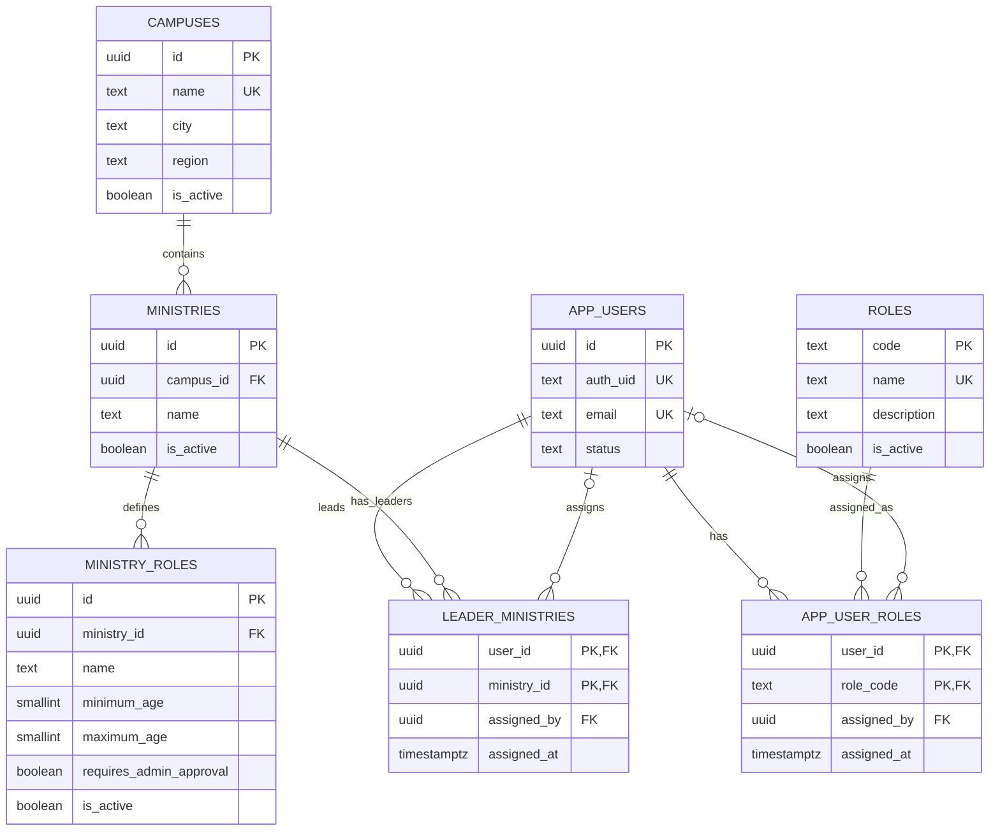
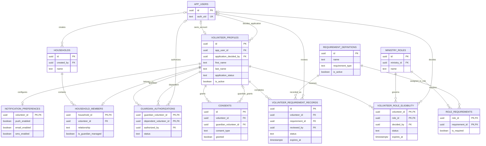
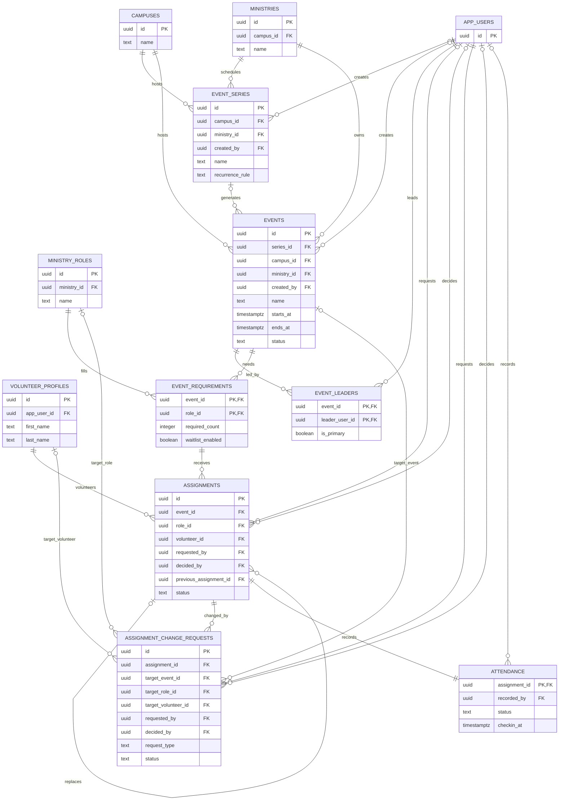
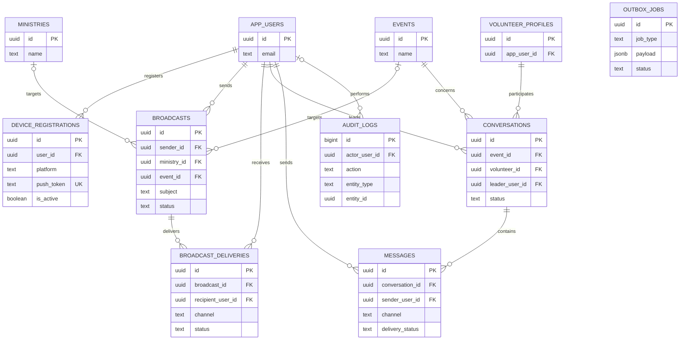
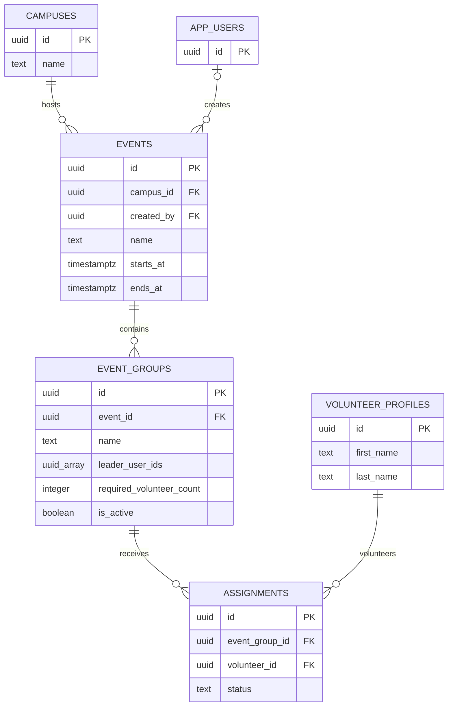

# VolunteerHub Entity Relationship Diagrams

These diagrams describe the base schema in `001_schema.sql`. The final section shows the Event Group scheduling
model implemented by `003_event_groups.sql`.

## Organization And Identity

## Volunteers, Households, And Compliance

## Current Event And Scheduling Model

> This is the current schema. It supports one ministry per event and will be replaced by the proposed Event Group
> model below.

## Communications And Operations

`OUTBOX_JOBS` and `AUDIT_LOGS.entity_id` are intentionally polymorphic and therefore do not have foreign keys to
the records referenced by their payload or entity fields.

## Implemented Event Group Model

This replaces the legacy event scheduling model. Volunteers sign up directly for an `EVENT_GROUP`.

## Current Reporting Views

Views are derived projections rather than stored entities:

- `event_staffing_summary`
- `event_role_staffing`
- `event_roster`
- `volunteer_requirement_status`
- `volunteer_role_readiness`
- `expiring_requirements`
- `volunteer_service_history`
- `volunteer_directory`
- `dashboard_metrics`

The Event Group migration replaces `event_role_staffing` with `event_group_staffing` and adds group fields to event
roster and event staffing projections.
