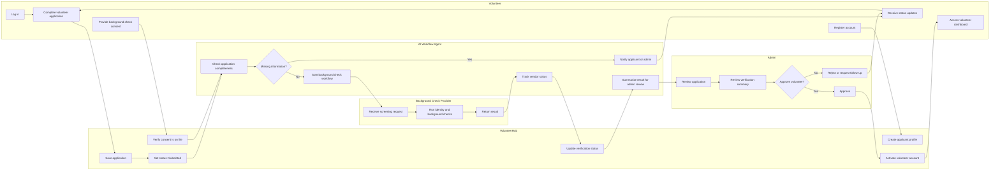

# Background Check Verification Flow

This flow shows how a volunteer moves from registration through verification and final admin approval.

## Demo Talking Point

The AI workflow agent does not approve or reject volunteers. It checks completeness, starts the background-check workflow, tracks status, summarizes results, and routes the application to an administrator. The final decision stays with a human reviewer.
